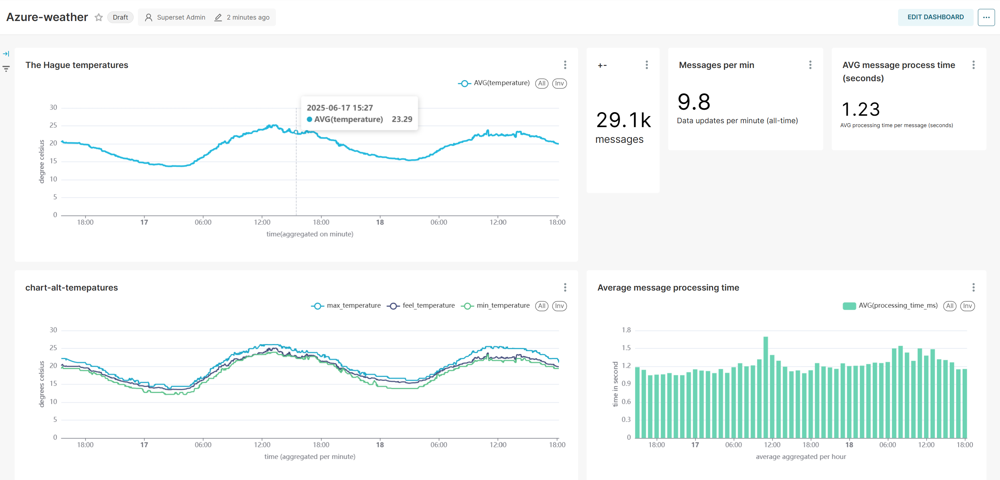

# Azure weather streaming data pipeline
This is a streaming data pipeline based on Azure Databricks, and Pyspark structured streaming, that processes weather data realtime.

[design]

## Superset Dashboard
With Apache Superset I created a dashboard with some basic stats about the data:
